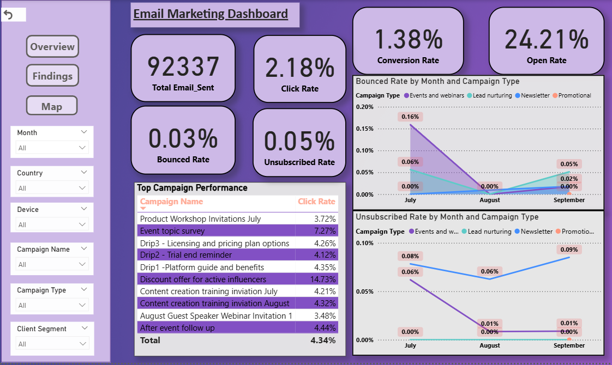
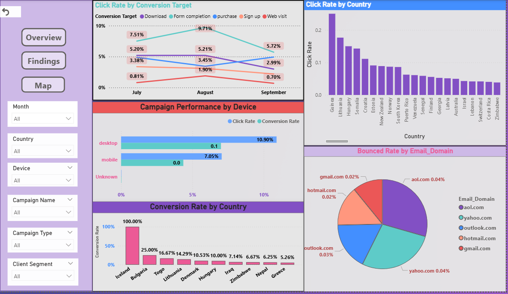
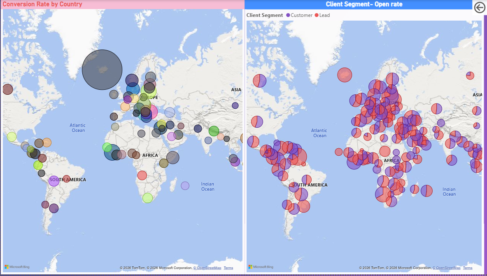

# 👋 Hi, I'm Joshua Thomas  
Data Analyst | Data-Driven Decision Making | Transforming Insights into Impact  

<!--Section 1: Introduction-->

## 🌟 About Me  
I am a Data Analyst with hands-on experience in Python, SQL, Excel, Power BI, and Tableau, with a strong focus on turning complex data into actionable business insights. Through academic and real-world projects, I have developed predictive models for insurance premiums, analyzed marketing campaign performance, detected fraud patterns, and created SQL-driven business insights to support strategic decisions.

Alongside my analytics experience, I worked as a Counselling Coordinator at Fair Future Overseas Educational Consultancy Pvt Ltd, where I managed structured client data, improved record systems, and increased response efficiency by 20%. This role strengthened my communication, problem-solving, and stakeholder management skills.

I completed a Postgraduate Program in Data Science and Business Analytics from University of Texas at Austin in collaboration with Great Learning, and I am eager to apply data-driven thinking to solve real-world business problems and grow as a data professional.
🚀 Let’s turn data into impactful stories!  

---

## 🎓 Education  
- **BSc Botany**  
  *Guruvayurappan College, Calicut (2019-2022)*
- **Post Graduate Program in Data Science and Business Analytics**  
  *University Of Texas (2023-2024)- Online- Great Learning*

---

## 💼 Work Experience  

### 🔹Counselling Coordinator - Fair Future Overseas Educational Consultancy Pvt Ltd (April 2024- September 2025)
- Managed structured client inquiry data using spreadsheets for streamlined decision-making.
- Maintained records of daily inquiries, improving access to key client information for senior executives.
- Collaborated with the internal team to optimize data logs, resulting in a 20% increase in client response efficiency.

---

## 📊 Projects  

### Email Marketing Campaign – [Power BI]   
🌍 Multiple companies Email Marketing Campaign details are provided.
🔍 Built an interactive dashboard to evaluate customer engagement, campaign effectiveness, and conversion outcomes. Created calculated columns and measures using DAX to derive meaningful marketing metrics. Identified high-performing and underperforming campaigns based on engagement and conversion metrics.
📈 Empowered the management with data-driven strategies for growth.
  

---

###	Health Care Project - Insurance Premium Prediction – [Python and Excel]  
🏨 The objective is to build a model, using data that provide the optimum insurance cost for an individual.  
💡 Successfully developed a Gradient Boosting model to predict insurance costs with high accuracy, allowing personalized pricing and effective risk management. 
📊 Insights from customer demographics and health indicators promote targeted strategies, helping customer retention and satisfaction. 
[🔗 View project](http://localhost:8888/notebooks/OneDrive/Desktop/My%20Great%20Learning/CAPSTONE%20PROJECT/JOSHUA_THOMAS_CAPSTONE_HEALTHCARE_PROJECT_final.ipynb)  

---

## 📜 Certifications  And Courses
- ✅ Codebasics Certified: Advanced Excel, Power BI Developer, SQL Developer  
- 🎯 SPES-Rashtriya Raksha University: Certificate in Sports Analytics  
- ⚽ Mad About Sports: Advanced Football Analytics Master Class  

---

## 🧠 Tools & Skills  
 
 
 
 
  

---

## 🎯 Interests  
- 📊 Dashboard Design  
- ⚽ Football & Cricket Analytics  
- 🎬 Movies & 🎒 Traveling  

---

## 📫 Contact Details  
*Let’s connect and see how we can make a difference together!*  

<table>
  <tbody>
    <tr>
      <td>📧</td>
      <td><a href="mailto:joshuathomas2722@gmail.com">joshuathomas2722@gmail.com</a></td>
    </tr>
    <tr>
      <td>📞</td>
      <td>(+91) 9207235922</td>
    </tr>
    <tr>
      <td>📍</td>
      <td>Kozhikode, Kerala</td>
    </tr>
    <tr>
      <td>⬇️</td>
      <td><a href="Boniface_Data_Analyst.pdf">Download my CV</a></td>
    </tr>
    <tr>
      <td>🌐</td>
      <td><a href="https://www.linkedin.com/in/joshuathom27/">Let’s connect on LinkedIn</a></td>
    </tr>
  </tbody>
</table>

